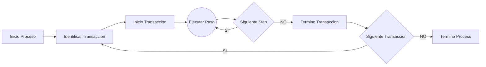

# SAP RPA Python v0.1
#### Control de Gestión
El siguiente programa se desarrollo pensando en automatizar los procedimientos manuales recurrentes del Área de Control de Gestión en SAP FI (SAP Logon).

- Desarrollado en Python
- Utilización de funciones SAPGUI
- Archivo de Configuración en JSON

<!--

-->


#### Archivo de Configuración
El archivo de configuración se utiliza para decirle especificarle los pasos y las acciones que debe ejecutar el programa en 

Estructura del Archivo
```json
{
    "saplogonpath": "C:\\Program Files (x86)\\SAP\\FrontEnd\\SAPgui\\saplogon.exe",
    "conectionName": "EP0 (Produccion ERP LatAm)",
    "username" : "",
    "password" : "",
    "transactions_execute": [
        {
    		"transaction_code":"ZCO_0137",
    	    "executions_steps": [
    	             { "step_id": 1,
    				   "comment":"Sociedad (0404,0077)",
    	               "type_find":"id",
	    	           "cod_find":"wnd[0]/usr/ctxtPA_KOKRS",
    	               "action":"text",
    				   "value_type":"input"
    	             },
    	             { "step_id": 2,
    	               "comment":"Accion Ejecutar",
    	               "type_find":"id",
    	               "cod_find":"wnd[0]/tbar[1]/btn[8]",
    	               "action":"press",
    				   "value_type":"na"
    	             },
    	             { "step_id":3,
    	               "comment":"",
    	               "type_find":"id",
    	               "cod_find":"wnd[0]/usr/cntlGV_CONTAINER_ALV_DETALLE/shellcont/shell",
    	               "action":"pressToolbarContextButton",
    				   "value_type":"fixed",
    				   "value": "&MB_EXPORT"
    	             }
    	 ]
}
```

| Item | Valor | Comentario|
|-------|-------|----------|
|"saplogonpath"|Ruta de Saplogon.exe| Esta se debe cambiar en caso de estar instalado SAP Logon en otra ubicación|
|"connectionName"|Nombre de la Conexión del SAP| Estos son los nombres de conexiones que están en SAP Logon|
|"username"|Usuario Conexión| Si esta en blanco el programa pedirá su ingreso|
|"password"|Password del usuario| Si esta en blanco el programa pedirá su ingreso|
|"transaction_code" | Código de Transacción | Código SAP de Transaccion necesario para abrir/ejecutar transacción mediante SAP Logon
|"comment" | Comentario | Este aparecerá en consola para dar seguimiento al flujo |
|"type_find" | Tipo de Búsqueda de Objeto | Validos:`[id]`|
|"cod_find" | Código de Objeto | Codigo del objeto a encontrar para ejecutar la acción sobre el |
|"action"| Accion a ejecutar sobre Objeto Encontrado |Validos: `[select, pressToolbarContextButton, selectContextMenuItem, key, press, text]` |
|"value_type" |Tipo de Valor a ingresas | Validos: `[input, fixed, na]` En caso de input el programa pedira el valor por consola, en caso de fixed tomara el valor del json |
|"value" |Valor a ingresar al objeto |Aplica para acciones: `[selectContextMenuItem, key, text]` |


> **Nota** para obtener el Id de los objetos de SAP Logon se puede utilizar la aplicación [Scripting Tracket](https://tracker.stschnell.de/)
